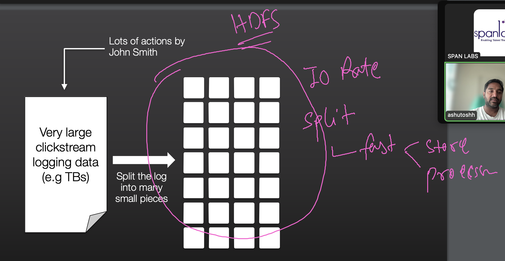
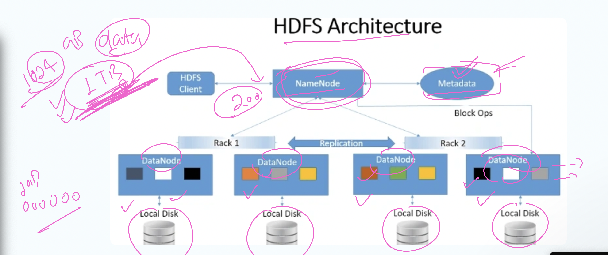
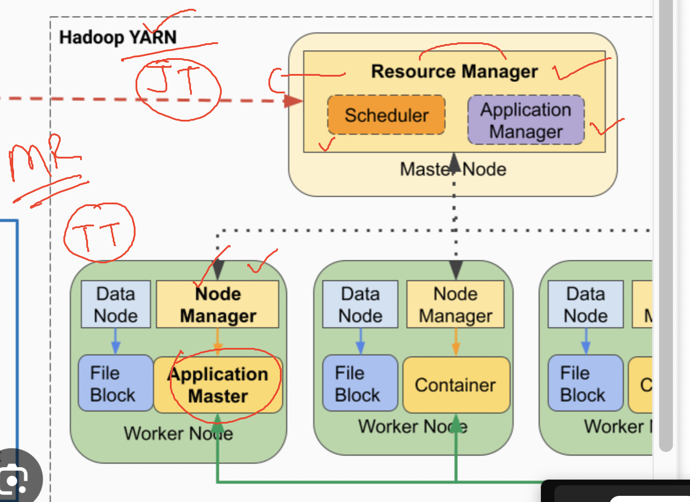

## Good to Know things given below 

### huge data storage with HDFS 

### HDFS 1 

## HDFS read and write operations INternal 

[click_here](https://slashbigdata.blogspot.com/2016/04/internals-of-hdfs.html)

### Distriubute process using  Map Reduce  

### Map Reduce 

## MR2 -- YARN 

## Spark basic workflow of architecture 

### Spark architecture overview 

