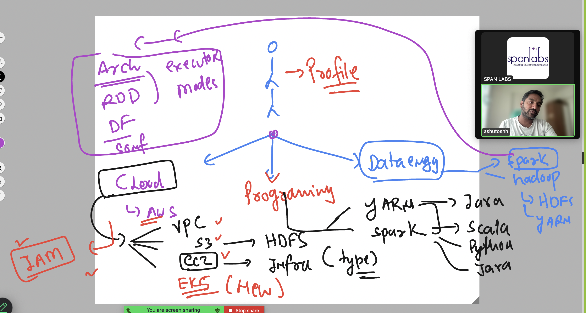

## Good to Know things given below 



### huge data storage with HDFS 


### HDFS 1 


## HDFS read and write operations INternal 

[click_here](https://slashbigdata.blogspot.com/2016/04/internals-of-hdfs.html)

### Distriubute process using  Map Reduce  


### Map Reduce 


## MR2 -- YARN 


## Spark basic workflow of architecture 


### Spark architecture overview 


### aws EMR (elastic Map Reduce)


### EMR  things to remember 

-- :**Release** 


### aws EMR -- master Node 


### EMR -- core node + task node 


### login to primary node 

```
ssh  hadoop@ec2-65-2-69-174.ap-south-1.compute.amazonaws.com
```

### accessing hdfs command line 

```
hdfs  dfs   -ls    / 
Found 3 items
drwxrwxrwt   - hdfs hdfsadmingroup          0 2024-11-13 09:16 /tmp
drwxr-xr-x   - hdfs hdfsadmingroup          0 2024-11-13 09:16 /user
drwxr-xr-x   - hdfs hdfsadmingroup          0 2024-11-13 09:16 /var
[hadoop@ip-10-0-29-84 ~]$ 
[hadoop@ip-10-0-29-84 ~]$ hdfs  dfs   -mkdir    /data/ashu-data 
mkdir: `hdfs://ip-10-0-29-84.ap-south-1.compute.internal:8020/data': No such file or directory
[hadoop@ip-10-0-29-84 ~]$ hdfs  dfs   -mkdir    /data/ 
[hadoop@ip-10-0-29-84 ~]$ hdfs  dfs   -mkdir    /data/ashu-data 
[hadoop@ip-10-0-29-84 ~]$ 
[hadoop@ip-10-0-29-84 ~]$ hdfs  dfs   -ls    / 
Found 4 items
drwxr-xr-x   - hadoop hdfsadmingroup          0 2024-11-13 10:17 /data
drwxrwxrwt   - hdfs   hdfsadmingroup          0 2024-11-13 09:16 /tmp
drwxr-xr-x   - hdfs   hdfsadmingroup          0 2024-11-13 09:16 /user
drwxr-xr-x   - hdfs   hdfsadmingroup          0 2024-11-13 09:16 /var
[hadoop@ip-10-0-29-84 ~]$ hdfs  dfs   -ls    /data 
Found 1 items
drwxr-xr-x   - hadoop hdfsadmingroup          0 2024-11-13 10:17 /data/ashu-data
[hadoop@ip-10-0-29-84 ~]$ 


```

### Downloading sample data

```
 mkdir   ashutoshh
[hadoop@ip-10-0-29-84 ~]$ cd  ashutoshh/
[hadoop@ip-10-0-29-84 ashutoshh]$ wget https://raw.githubusercontent.com/redashu/Datasets/refs/heads/master/annual-enterprise-survey-2023-financial-year-provisional.csv
--2024-11-13 10:21:14--  https://raw.githubusercontent.com/redashu/Datasets/refs/heads/master/annual-enterprise-survey-2023-financial-year-provisional.csv
Resolving raw.githubusercontent.com (raw.githubusercontent.com)... 185.199.111.133, 185.199.109.133, 185.199.108.133, ...
Connecting to raw.githubusercontent.com (raw.githubusercontent.com)|185.199.111.133|:443... connected.
HTTP request sent, awaiting response... 200 OK
Length: 8065547 (7.7M) [text/plain]
Saving to: ‘annual-enterprise-survey-2023-financial-year-provisional.csv’

annual-enterprise-survey-2023-financi 100%[========================================================================>]   7.69M  --.-KB/s    in 0.02s   

2024-11-13 10:21:15 (432 MB/s) - ‘annual-enterprise-survey-2023-financial-year-provisional.csv’ saved [8065547/8065547]

[hadoop@ip-10-0-29-84 ashutoshh]$ ls
annual-enterprise-survey-2023-financial-year-provisional.csv
[hadoop@ip-10-0-29-84 ashutoshh]$ 

```
