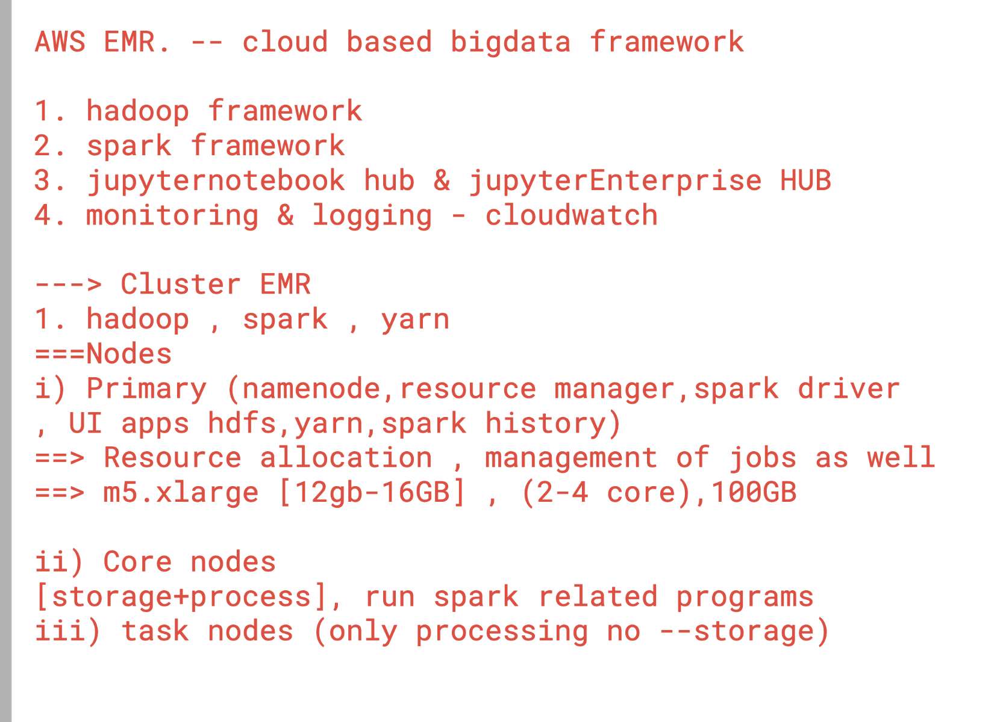

## Revision and overview 

### Nodes in EMR



### Instance family types 


### any one from each team can do that 

```
 1  sudo -i
    2  ls
    3  mkdir  ashutoshh
    4  cd ashutoshh/
    5  yes  "spark is having support of python java scala r"  >ashu.txt
    6  ls -lh  ashu.txt 
    7  hdfs dfs  -ls /
    8  hdfs dfs  -mkidr  /common-data
    9  hdfs dfs  -mkdir   /common-data
   10  hdfs dfs  -ls /
   11  hdfs dfs  -ls /common-data/text
   12  hdfs dfs  -mkdir  /common-data/text
   13  ls
   14  hdfs dfs -copyFromLocal ashu.txt   /common-data/text/
   15  hdfs dfs -ls  /common-data/text
   16  history 

```
## spark bigdata word count example 


