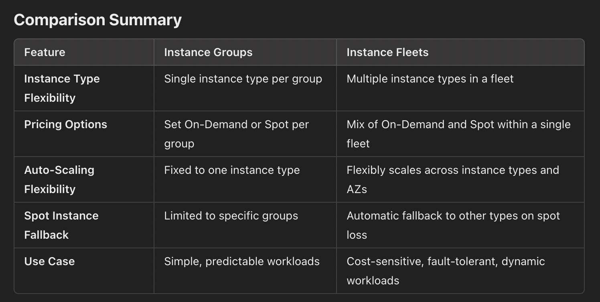
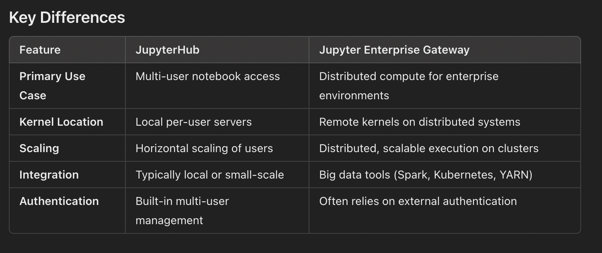

## Instance group vs Instance fleet 

## JupyterHub vs JupyterEnterpriseGateway

# EMR Node Configuration Guide

This guide provides recommendations on configuring Amazon EMR clusters based on specific data sources, data types, and processing engines (Spark, YARN). Each configuration is optimized for cost, performance, and storage, depending on your use case.

---

## Node Types Overview

### 1. Master Node
- **Role**: Coordinates cluster operations, manages task distribution, and tracks cluster health.
- **Instance Type**: Often smaller, such as `m5.xlarge` or `r5.xlarge`, as it does not handle data processing.
- **Recommendation**: Ensure sufficient resources for coordination tasks; data-intensive resources are not required.

### 2. Core Nodes
- **Role**: Executes processing tasks and stores data if using HDFS.
- **Instance Types**:
  - `r5` family (e.g., `r5.2xlarge`) for memory-intensive tasks (e.g., large Spark transformations).
  - `m5` family (e.g., `m5.xlarge`) for balanced memory and CPU workloads.
  - `i3` family (e.g., `i3.4xlarge`) for high I/O workloads needing local storage.

### 3. Task Nodes
- **Role**: Provides additional processing capacity without storing HDFS data.
- **Instance Types**:
  - `c5` family (e.g., `c5.2xlarge`) for compute-heavy tasks.
  - `m5` family for balanced memory and compute needs.
  - **Spot Instances**: Can be used for cost-saving, especially with non-critical, stateless workloads.

---

## Scenario-Specific Configurations

### 1. HDFS-Dependent Workloads
- **Data Source**: Data is stored on HDFS.
- **Node Configuration**: Core nodes need sufficient storage for HDFS data.
- **Instance Types**:
  - **Master Node**: `m5.xlarge`
  - **Core Nodes**: `i3.4xlarge` or `r5` family
  - **Task Nodes**: Optional
- **Recommended Engines**: YARN or Spark

### 2. S3-Only Storage (No HDFS)
- **Data Source**: Data is stored on S3.
- **Node Configuration**: Core nodes do not require large storage, as HDFS is not in use.
- **Instance Types**:
  - **Master Node**: `m5.xlarge`
  - **Core Nodes**: `m5` or `c5`
  - **Task Nodes**: Optional, add as needed
- **Recommended Engines**: Spark or YARN

### 3. YARN-Only Cluster (No Spark)
- **Data Source**: Data can reside on HDFS or S3.
- **Node Configuration**: Core nodes manage YARN allocations.
- **Instance Types**:
  - **Master Node**: `m5.xlarge`
  - **Core Nodes**: `r5` or `c5`
  - **Task Nodes**: Optional
- **Recommended Use**: For workloads managed by YARN, including MapReduce or Tez applications.

### 4. Spark on YARN with HDFS
- **Data Source**: Primarily HDFS, with S3 as auxiliary.
- **Node Configuration**: Core nodes store HDFS data and handle Spark tasks.
- **Instance Types**:
  - **Master Node**: `m5.xlarge`
  - **Core Nodes**: `r5` family or `i3`
  - **Task Nodes**: Optional, for additional Spark capacity
- **Recommended Use**: Best for Spark and YARN, leveraging data locality with HDFS.

### 5. Spark Standalone with S3 Storage
- **Data Source**: S3.
- **Node Configuration**: Core nodes do not require large storage.
- **Instance Types**:
  - **Master Node**: `m5.xlarge`
  - **Core Nodes**: `c5` or `m5`
  - **Task Nodes**: Ideal for spot scaling
- **Recommended Use**: Spark workloads directly read/write to S3.

---

## Summary Table

| Scenario                     | Data Source | Core Node Instance Type  | Task Node Use           | Recommended Engines         |
|------------------------------|-------------|--------------------------|--------------------------|-----------------------------|
| HDFS-Dependent               | HDFS        | `i3.4xlarge` / `r5`     | Optional                 | YARN, Spark                 |
| S3-Only                      | S3          | `m5` / `c5`             | Add as needed            | Spark, YARN                 |
| YARN-Only                    | HDFS/S3     | `r5` (memory) / `c5`    | Optional                 | YARN (MapReduce, Tez)       |
| Spark on YARN with HDFS      | HDFS        | `r5` / `i3`             | Add as needed            | Spark on YARN               |
| Spark Standalone with S3     | S3          | `c5` / `m5`             | Ideal for spot scaling   | Spark                       |

---

## Additional Notes

- **Spot Instances**: Use task nodes as spot instances when workloads can tolerate interruptions.
- **Instance Fleet vs. Instance Groups**:
  - **Instance Fleet** allows you to specify multiple instance types and bid strategies, optimizing cost and availability.
  - **Instance Groups** restrict each node type to a single instance type, simplifying management.

---

This guide is designed to help configure EMR nodes tailored to specific workload requirements, balancing cost, performance, and storage.
