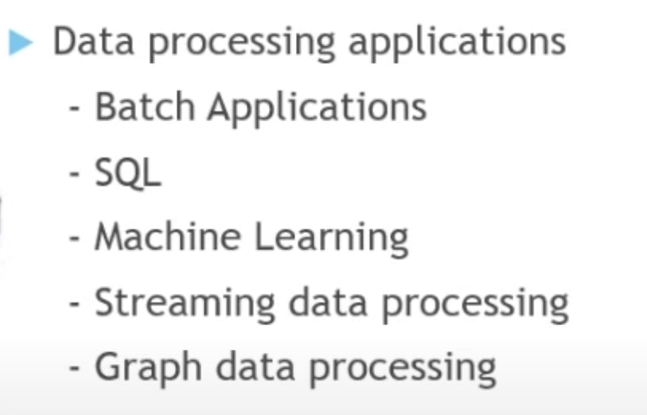
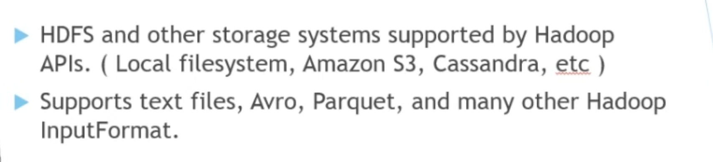
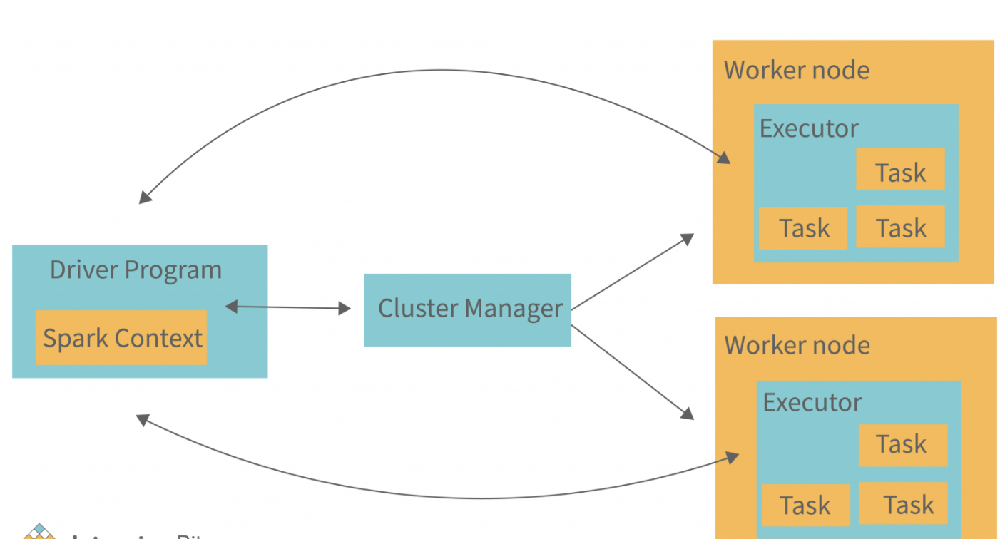
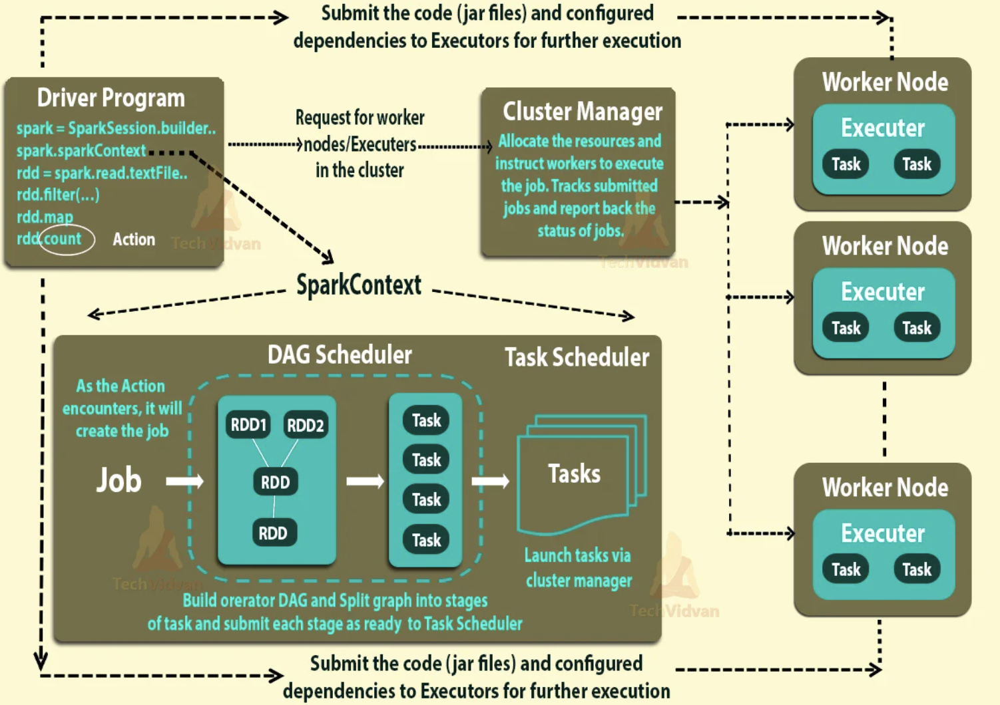
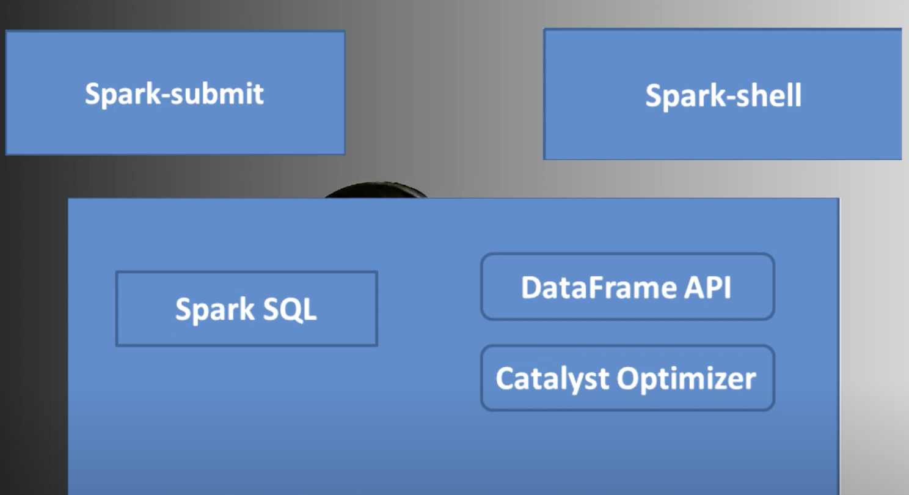

### space Left with Intention -- for future updates 

### Spark Usage 



### Reading data from Sources 



## RDD -- (Resilient Distributed Dataset)-- Resilient -- (having power to recover itself)

<p> RDD's are Immutable </p>

# Transformation & Action 

## Transformation 
### making another RDD from One RDD is trasformation -- like Scala based example given below 

```
val  x1 = sc.textFile("hdfs://....") # RDD 1
val y1  = x1.flatMap(...)
val z1 = y1.distinct(...)
```

## Action 

### the real state where things are getting started with execution process -- Before that it will only create structure (DAG)

<p> Extending the same Example </p>

```
z1.collect() 
```

## apache spark architecture 



## Info about Driver programe -- (most important to understand)

# Apache Spark Driver Program

The Spark driver program is the main entry point for Spark applications. It is responsible for orchestrating the execution of the application, including:

- **Application Initialization**: The driver program initializes the Spark application, setting up the SparkSession (or SparkContext in older versions) and any configuration settings.

- **Job Submission**: The driver program submits Spark jobs to the Spark cluster for execution. A Spark job consists of one or more transformations and actions defined by the user in their application code.

- **Task Scheduling**: The driver breaks down Spark jobs into smaller units of work called tasks and schedules them to be executed on the cluster's worker nodes.

- **Resource Management**: The driver negotiates with the cluster manager (e.g., Spark standalone, YARN, Kubernetes) to acquire resources (CPU cores, memory) for executing tasks.

- **Monitoring and Logging**: The driver monitors the progress of Spark jobs and collects task execution logs. It also aggregates and presents information about the application's execution, such as job completion status, task durations, and resource usage.

- **Fault Tolerance**: The driver handles failures and retries tasks as needed to ensure the successful completion of the application. It also manages the lineage of RDDs (Resilient Distributed Datasets) to provide fault tolerance and support for recomputation in case of failures.

- **Result Aggregation**: For actions that return results to the driver (e.g., collect(), reduce()), the driver aggregates and processes the results before presenting them to the user or storing them to external systems.

In client mode, the driver program runs on the machine from which the Spark application is submitted (e.g., your local machine). In cluster mode, the driver program runs within the Spark cluster itself, typically on one of the worker nodes.

Overall, the driver program plays a crucial role in coordinating the execution of Spark applications, managing resources, handling failures, and providing feedback to users about the application's progress and results.


# Apache Spark Deploy Modes

In Apache Spark, there are three deploy modes: client, cluster, and cluster-client. Each mode has its own characteristics and use cases:

## Client Mode

In client mode:

- The driver program runs on the machine where you execute the `spark-submit` command.
- The driver communicates directly with the Spark cluster's master and executors.
- Suitable for development and debugging, as it provides easy access to the driver's logs and UI.

## Cluster Mode

In cluster mode:

- The driver program runs within the Spark cluster itself, typically on one of the worker nodes.
- The client machine (where you execute the `spark-submit` command) is responsible only for submitting the application to the cluster.
- Once the application is submitted, the client machine is no longer involved in its execution.
- Commonly used for production deployments, as it allows for better resource utilization and scalability.

## Cluster-Client Mode

In cluster-client mode:

- The driver program runs on the client machine, similar to client mode.
- However, the executor processes run on the worker nodes within the Spark cluster.
- Combines aspects of both client and cluster modes, offering some advantages of each.
- Provides better resource utilization and isolation compared to client mode, while still allowing access to the driver's logs and UI.
- Suitable for interactive or iterative workloads where you need access to the driver program's logs and UI but want to leverage the resources of the Spark cluster for computation.

These deploy-mode options provide flexibility in how Spark applications are deployed and executed, allowing you to choose the mode that best fits your requirements based on factors such as resource utilization, debugging capabilities, and production deployment needs.


### Deep Internal process of running jobs in spark 



## WHy to use spark SQl 



