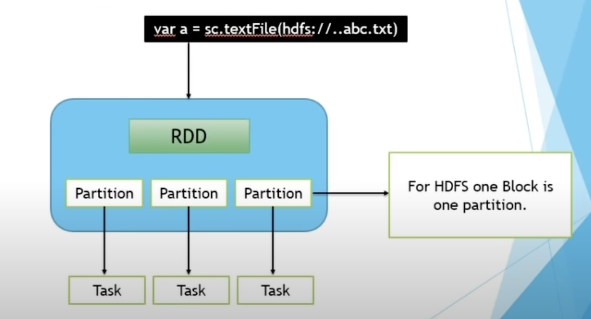

## Spark is Doing everything using RDD 

### Important point to Remember in RDD data is getting stored in partitioned format

### RDD is having  2 kind of operations 

<ol>
    <li> Transformation </li>
    <li> Action </li>
</ol>

### Example of Transformation and action methods

### Now Transformation is also having 2 types 

<ol>
    <li> narrow </li> ----->  Doing operation in ONE RDD (partition) -- and storing in just another RDD (partition)
    <li> Wide </li>  ------> Doing operation in ONE RDD (partition) -- and storing in many other  RDD (partition)
</ol>

### A visual Difference 

## Some Poluplar list of methods in Narrow transfromation 

### Narrorw Transformation 

### Wide Transformation

## A generic list of  methods in transformation 

**Narrow Transformations:**

1. `map(func)`: Applies a function to each element in the RDD and returns a new RDD with the results.
2. `filter(func)`: Applies a predicate function to each element in the RDD and returns a new RDD containing only the elements that satisfy the predicate.
3. `flatMap(func)`: Similar to map, but each input item can be mapped to 0 or more output items (a sequence).
4. `mapPartitions(func)`: Similar to map, but runs separately on each partition of the RDD.
5. `mapPartitionsWithIndex(func)`: Similar to mapPartitions, but also provides the index of the partition.
6. `flatMapPartitions(func)`: Similar to flatMap, but runs separately on each partition of the RDD.
7. `sample(withReplacement, fraction, seed)`: Samples a fraction of data from the RDD with or without replacement.
8. `mapValues(func)`: Applies a function to the values of each key-value pair in a PairRDD, while retaining the original keys.
9. `flatMapValues(func)`: Similar to flatMap, but operates on key-value pairs and can produce 0 or more output pairs for each input pair.

**Wide Transformations:**

1. `groupByKey()`: Groups the values of each key in a PairRDD into a single sequence.
2. `reduceByKey(func)`: Aggregates the values of each key using a specified function.
3. `combineByKey(createCombiner, mergeValue, mergeCombiners)`: Similar to reduceByKey, but allows for more flexibility in the output format.
4. `foldByKey(zeroValue, func)`: Similar to reduceByKey, but with an additional initial zero value.
5. `aggregateByKey(zeroValue, seqFunc, combFunc)`: Similar to combineByKey, but with the ability to specify separate aggregation functions for combining values within a partition and across partitions.
6. `sortByKey(ascending)`: Sorts the elements of a PairRDD by key.

## Now Popular spark context (sc) operations 

### SC is having lot of method inbuild -- here is some list 

# SparkContext Keywords

Below are some common methods and properties available in the SparkContext (`sc`) object:

1. **parallelize(data, numSlices)**:
   - Creates an RDD from a collection of data by distributing it across the specified number of partitions.

2. **textFile(path, minPartitions)**:
   - Reads a text file from the specified path and creates an RDD of strings, with each line in the file becoming an element of the RDD.

3. **wholeTextFiles(path, minPartitions)**:
   - Reads a directory of text files, where each file is read as a single record, with the file path as the key and the file content as the value.

4. **broadcast(variable)**:
   - Broadcasts a read-only variable to all worker nodes, making it accessible for efficient, distributed operations.

5. **accumulator(initialValue, accumulableParam)**:
   - Creates an accumulator, which is a shared variable that can be used to aggregate information across tasks or stages in a distributed computation.

6. **setCheckpointDir(dirPath)**:
   - Sets the directory for checkpointing RDDs, allowing for fault tolerance by saving RDD lineage information to a reliable storage system.

7. **stop()**:
   - Stops the SparkContext, releasing allocated resources and shutting down all associated components.

8. **appName**:
   - Property representing the name of the Spark application.

9. **defaultMinPartitions**:
   - Property representing the default minimum number of partitions to use when not explicitly specified.

10. **defaultParallelism**:
    - Property representing the default level of parallelism to use for operations like parallelize when the number of partitions is not specified.

These are some of the key methods and properties available in the SparkContext (`sc`) object that you can use to interact with Apache Spark and perform distributed computations.

